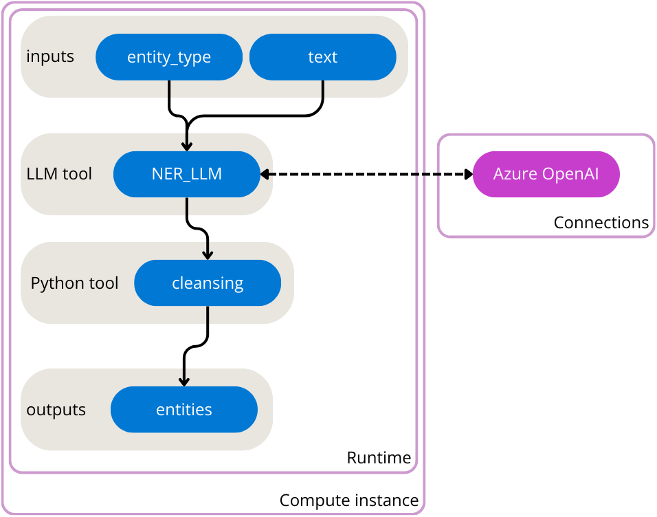

---
lab:
    title: 'Get started with a standard flow in prompt flow'
---

# Get started with a standard flow in prompt flow

Extracting valuable information from text is known as Named Entity Recognition (NER). Entities are key words that are of interest to you in a given text.


Large Language Models (LLMs) can be used to perform NER. To create an application that takes a text as input and outputs entities, you can create a flow that uses a LLM node with prompt flow.

In this exercise, you'll use Azure Machine Learning's prompt flow to create an LLM application that expects an entity type and text as input. It calls a GPT model from Azure OpenAI through a LLM node to extract the required entity from the given text, cleans the result and outputs the extracted entities.



You'll first create an Azure OpenAI service and deploy a GPT model. You'll then create an Azure Machine Learning service to use prompt flow. Before creating the flow, you'll create the necessary compute instance, runtime, and connection (connecting to your deployed GPT model from Azure OpenAI). Finally, you'll run the flow to test it and view sample output.

## Before you start

You'll need an [Azure subscription](https://azure.microsoft.com/free?azure-portal=true) in which you have administrative-level access.

## Create the Azure OpenAI service to deploy a GPT model

To use a LLM model in prompt flow, you need to deploy a model through Azure OpenAI first.

### Provision an Azure OpenAI resource

If you don't already have one, provision an Azure OpenAI resource in your Azure subscription.

1. Sign into the [Azure portal](https://portal.azure.com) at `https://portal.azure.com`.
2. Create an **Azure OpenAI** resource with the following settings:
    - **Subscription**: *Select an Azure subscription that has been approved for access to the Azure OpenAI service*
    - **Resource group**: `rg-prompt-flow-labs`
    - **Region**: *Make a **random** choice from any of the available regions*\*
    - **Name**: *A unique name of your choice*
    - **Pricing tier**: Standard S0

    > \* Azure OpenAI resources are constrained by regional quotas. Randomly choosing a region reduces the risk of a single region reaching its quota limit in scenarios where you are sharing a subscription with other users. In the event of a quota limit being reached later in the exercise, there's a possibility you may need to create another resource in a different region.

3. Wait for deployment to complete. Then go to the deployed Azure OpenAI resource in the Azure portal.

### Save the endpoint and key

To authorize Azure Machine Learning to use a model deployed with Azure OpenAI, it needs the endpoint and key.

1. Navigate to the **Keys and Endpoint** page of your Azure OpenAI resource.
1. Copy the value of the **Endpoint** and store it in a notepad for future use. The value should be similar to `https://<your-openai-service-name>.openai.azure.com/`.
1. Copy the value of one of the **Keys** and store it in a notepad for future use.

### Deploy a model

Azure OpenAI provides a web-based portal named **Azure OpenAI Studio**, that you can use to deploy, manage, and explore models. You'll use the Azure OpenAI Studio to deploy a model.

1. On the **Overview** page for your Azure OpenAI resource, use the **Go to Azure OpenAI Studio** button to open Azure OpenAI Studio in a new browser tab.
1. In Azure OpenAI Studio, navigate to the **Deployments** page.
1. Create a new deployment of the **gpt-35-turbo** model with the following settings:
    - **Model**: `gpt-35-turbo`
    - **Model version**: Auto-update to default
    - **Deployment name**: `gpt-35-turbo`

Now that you have your LLM model deployed, you can create a flow in Azure Machine Learning that calls the deployed model.

## Provision the necessary resources to create a flow

To work with prompt flow, you first need to provision an Azure Machine Learning workspace.

### Provision an Azure Machine Learning resource

If you don't already have one, provision an Azure Machine Learning resource in your Azure subscription.

1. Navigate to the [Azure portal](https://portal.azure.com) at `https://portal.azure.com`.
1. Create a new **Azure Machine Learning** resource with the following settings (keep everything else at default):
    - **Subscription**: *Your Azure subscription*
    - **Resource group**: `rg-prompt-flow-labs`
    - **Workspace name**: `mlw-prompt-flow-labs`
    - **Region**: *Select the geographical region closest to you*
1. Wait for the workspace and its associated resources to be created - this typically takes around 5 minutes.

### Create a compute instance

When the Azure Machine Learning resource has been created, you can use the Azure Machine Learning studio to create the compute instance that will be used by the runtime.

1. Select your Azure Machine Learning workspace.
1. Select **Launch studio** from the **Overview** page. Another tab will open in your browser to open the Azure Machine Learning studio.
1. Close any pop-ups that appear in the studio.
1. In the Azure Machine Learning studio, select the **Compute** page from the menu on the left side.
1. On the **Compute instances** tab, create a new compute instance with the following settings:
    - **Compute name**: *Enter a name*
    - **Virtual machine type**: `CPU`
    - **Virtual machine size**: `Standard_E4s_v3`

While waiting for the compute instance to be created and to start running, you can continue with the next steps.

### Create a connection

To perform NER in a prompt flow, you'll call the GPT model you deployed with Azure OpenAI. For Azure Machine Learning to call the deployed model, you need to create a connection that stores the endpoint and key of your Azure OpenAI resource.

1. In the Azure Machine Learning studio, navigate to the **Prompt flow** page.
1. Select the **Connections** tab.
1. Create a new Azure OpenAI connection with the following settings:
    - **Name**: `aoai`
    - **Provider**: `Azure OpenAI`
    - **Subscription id**: *Select your subscription*
    - **Azure OpenAI Account Names**: *Select the name of your Azure Open AI resource*
    - **API key**: *Enter your saved key*
    - **API base**: *Enter your saved endpoint*
    - **API type**: `azure`
    - **API version**: `2023-07-01-preview`

### Create the runtime

To run a flow, you need a runtime, which includes the necessary packages installed on a compute instance to run your nodes. As you're creating a simple flow, you can use the default environment to create the necessary runtime.

1. On the **Prompt flow** page, select the **Runtime** tab.
1. Create a new runtime with the following settings:
    - **Runtime name**: *Enter a name*
    - **Select AzureML compute instance**: *Select the compute instance created in the previous section*
    - **Custom application**: `New`
    - **Environment**: `Use default environment`
1. When prompted to auto restart the compute instance, select **Confirm**.

Your compute instance will restart to create the new runtime. While the compute instance is restarting, you can continue with the next steps.

## Create and run a flow in Azure Machine Learning

Now that you have all necessary resources provisioned, you can create a flow.

### Create a new flow

To create a new flow with a template, you can select one of the types of flows you want to develop.

1. On the **Prompt flow** page, select the **Flows** tab.
1. Create a new **Standard flow** and enter `entity-recognition` as folder name.

A standard flow with one input, two nodes, and one output is created for you. You'll update the flow to take two inputs, extract entities, clean up the output from the LLM node, and return the entities as output.

### Configure the inputs

The flow you'll create will take two inputs: a text and the type of entity you want to extract from the text.

1. After creating the new flow that you named `entity-recognition`, the flow should open in the studio.
1. Under **Inputs**, one input is configured named `topic` of type `string`. Change the existing input and update with the following settings:
    - **Name**: `entity_type`
    - **Type**: `string`
    - **Value**: `job title`
1. Select **Add input**.
1. Configure the second input to have the following settings:
    - **Name**: `text`
    - **Type**: `string`
    - **Value**: `The software engineer is working on a new update for the application.`

### Configure the LLM node

The standard flow already includes a node that uses the LLM tool. You can find the node in your flow overview. The default prompt asks for a joke. You'll update the LLM node to extract entities based on the two inputs specified in the previous section.

1. Navigate to the **LLM node** named `joke`.
1. Replace the name with `NER_LLM`
1. For **Connection**, select the `aoai` connection you created previously.
1. For **deployment_name**, select the `gpt-35-turbo` model you deployed in Azure OpenAI.
1. Replace the prompt field with the following code:

   ```
   system:

   Your task is to find entities of a certain type from the given text content.
   If there're multiple entities, please return them all with comma separated, e.g. "entity1, entity2, entity3".
   You should only return the entity list, nothing else.
   If there's no such entity, please return "None".

   user:

   Entity type: {{{{entity_type}}}}
   Text content: {{{{text}}}}
   Entities:
   ```

1. Select **Validate and parse input**.
1. Within the LLM node, in the **Inputs** section, configure the following:
    - For `entity_type`, select the value `${inputs.entity_type}`.
    - For `text`, select the value `${inputs.text}`.

Your LLM node will now take the entity type and text as inputs, include it in the prompt you specified and send the request to your deployed model in Azure OpenAI.

### Configure the Python node

To extract only the key information from the result of the model, you can use the Python tool to clean up the output of the LLM node.

1. Navigate to the Python node named `echo`.
1. Replace the name with `cleansing`.
1. Replace the code with the following:

   ```python
   from typing import List
   from promptflow import tool
    
    
   @tool
   def cleansing(entities_str: str) -> List[str]:
       # Split, remove leading and trailing spaces/tabs/dots
       parts = entities_str.split(",")
       cleaned_parts = [part.strip(" \t.\"") for part in parts]
       entities = [part for part in cleaned_parts if len(part) > 0]
       return entities
    
   ```

1. Select **Validate and parse input**.
1. Within the Python node, in the **Inputs** section, set the value of `entities_str` to `${NER_LLM.output}`.

### Configure the output

Finally, you can configure the output of the whole flow. You only want one output to your flow, which should be the extracted entities.

1. Navigate to the flow's **Outputs**.
1. For **Name**, enter `entities`.
1. For **Value**, select `${cleansing.output}`.

### Run the flow

Now that you've developed the flow, you can run it to test it. Since you've added default values to the inputs, you can easily test the flow in the studio.

1. Select the runtime you created in a previous section for the **Runtime**.
1. Select **Run** to test the flow.
1. Wait until the run is completed.
1. Select **View outputs**. A pop-up should appear showing you the output for the default inputs. Optionally, you can also inspect the logs.

## Delete Azure resources

When you finish exploring Azure Machine Learning, you should delete the resources you’ve created to avoid unnecessary Azure costs.

- Close the Azure Machine Learning studio tab and return to the Azure portal.
- In the Azure portal, on the **Home** page, select **Resource groups**.
- Select the resource group `rg-prompt-flow-labs`.
- At the top of the **Overview** page for your resource group, select **Delete resource group**.
- Enter the resource group name to confirm you want to delete it, and select **Delete**.
